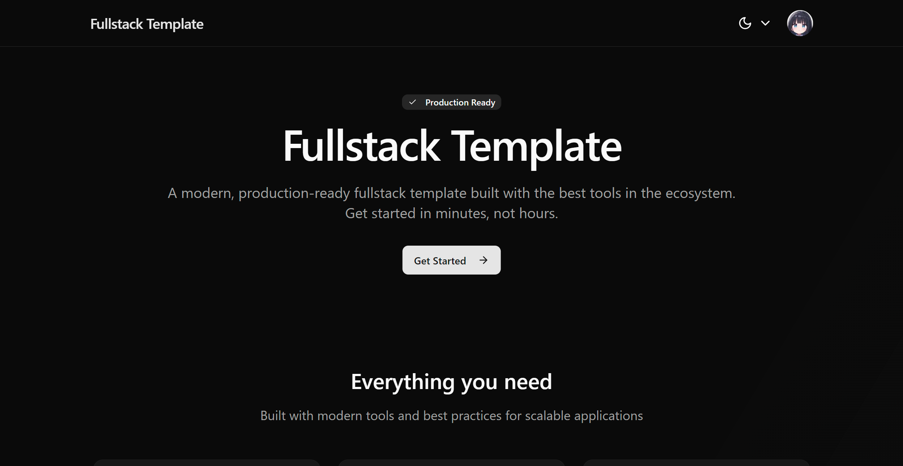

# Fullstack Template

[](https://github.com/caru-ini/fullstack-template/actions/workflows/ci.yaml)
[](https://www.typescriptlang.org/)
[](https://pnpm.io)
[](https://nextjs.org/)
[](https://react.dev)
[](https://hono.dev)
[](https://www.prisma.io/)
[](https://www.better-auth.com/)
[](https://ui.shadcn.com/)
[](LICENSE)

A modern, production-ready fullstack template built with Next.js, Hono, Better Auth, Prisma, and shadcn/ui. Type-safe, performance-oriented, and designed for fast onboarding.

---

## Why this template

- Focused stack: Next.js App Router + Hono RPC for typed server communication
- Production-ready auth: Better Auth with RBAC-ready scaffolding
- Database first: PostgreSQL via Prisma, Docker Compose provided
- Polished UI/UX: shadcn/ui + Tailwind with dark mode and accessible patterns
- Developer experience: pnpm, ESLint, Prettier, Husky, and strict TypeScript

## Features

- Authentication with Better Auth (GitHub OAuth ready)
- Type-safe API routes with Hono (RPC and REST)
- PostgreSQL with Prisma ORM
- UI components with shadcn/ui and Radix UI
- Beautiful progress bar with bprogress/next
- Dark/light theme via next-themes
- Optional S3 file upload (AWS S3 or MinIO)
- Full TypeScript and strict checks

## Tech Stack

- Frontend: Next.js 15, React 19, Tailwind CSS 4, shadcn/ui, Lucide Icons, React Icons
- Backend: Hono (RPC ready), Better Auth, Zod validation
- Data: PostgreSQL, Prisma 6
- Tooling: TypeScript 5, pnpm, ESLint 9, Prettier 3, Husky, lint-staged

## Screenshot



## Quick Start

### Prerequisites

- Node.js 18+
- pnpm
- Docker & Docker Compose (for database)

### Setup

1. Clone and install

```bash
git clone https://github.com/caru-ini/fullstack-template
cd fullstack-template
pnpm install
```

1. Environment variables

```bash
cp .env.example .env
# Generate a secret for Better Auth
pnpx @better-auth/cli secret
```

Fill in `.env` according to your environment. The keys are validated by `src/env.ts` (T3 Env).

1. Start services

```bash
docker compose up -d
```

1. Generate Prisma schema from Better Auth

```bash
pnpx @better-auth/cli generate
```

1. Push database schema

```bash
pnpm db db push  # or: pnpm dlx prisma db push
```

1. Start the dev server

```bash
pnpm dev
```

Visit http://localhost:3000

## Available Scripts

| Script | Description |
|--------|-------------|
| `pnpm dev` | Start development server (Turbo) |
| `pnpm build` | Build for production |
| `pnpm start` | Start production server |
| `pnpm preview` | Build and start production server |
| `pnpm lint` | Run ESLint |
| `pnpm lint:fix` | Fix ESLint issues |
| `pnpm typecheck` | TypeScript type checking |
| `pnpm fmt:check` | Check code formatting |
| `pnpm fmt:write` | Format code with Prettier |
| `pnpm check` | Linting and type checking |
| `pnpm db` | Prisma CLI |

## Continuous Integration

- Workflow: `.github/workflows/ci.yaml` ([view on GitHub](https://github.com/caru-ini/fullstack-template/actions/workflows/ci.yaml))
- Triggers: `push` to `main`, `pull_request`
- Steps:
  - Install dependencies with pnpm
  - Prettier format check (`pnpm fmt:check`)
  - ESLint (`pnpm lint`)
  - TypeScript typecheck (`pnpm typecheck`)
  - Build (`pnpm build`)

### Reproduce CI locally

```bash
pnpm install &&
pnpm fmt:check &&
pnpm lint &&
pnpm typecheck &&
pnpm build
```

Notes:

- The CI sets dummy environment variables to satisfy build-time validation. When building locally, copy `.env.example` to `.env` and fill required keys.

## Project Structure

```plaintext
src/
├── app/                    # Next.js App Router
│   ├── (about)/            # Route groups
│   ├── api/                # API routes
│   │   ├── [[...route]]/   # Hono API routes
│   │   └── auth/           # Better Auth endpoints
│   └── globals.css         # Global styles
├── components/             # Reusable components
│   ├── auth/               # Authentication components
│   ├── layout/             # Layout components
│   ├── misc/               # Miscellaneous components
│   ├── providers/          # Context providers
│   └── ui/                 # shadcn/ui components
├── lib/                    # Utilities
│   ├── auth.ts             # Better Auth configuration
│   ├── auth-client.ts      # Client-side auth utilities
│   ├── db.ts               # Database connection
│   ├── hono.ts             # Hono client setup
│   ├── s3-client.ts        # S3 client setup
│   └── utils.ts            # Utility functions
└── env.ts                  # Environment variable validation
```

## Deployment

### Vercel (recommended)

1. Push your code to GitHub
1. Connect the repository to Vercel
1. Set environment variables in the Vercel dashboard
1. Deploy on every push

## Contributing

1. Fork the repository
1. Create your feature branch (`git checkout -b feature/amazing-feature`)
1. Commit your changes (`git commit -m 'feat: add amazing feature'`)
1. Push to the branch (`git push origin feature/amazing-feature`)
1. Open a Pull Request

## License

MIT — see [LICENSE](LICENSE).

---

If this project helps you, please consider giving it a star.
